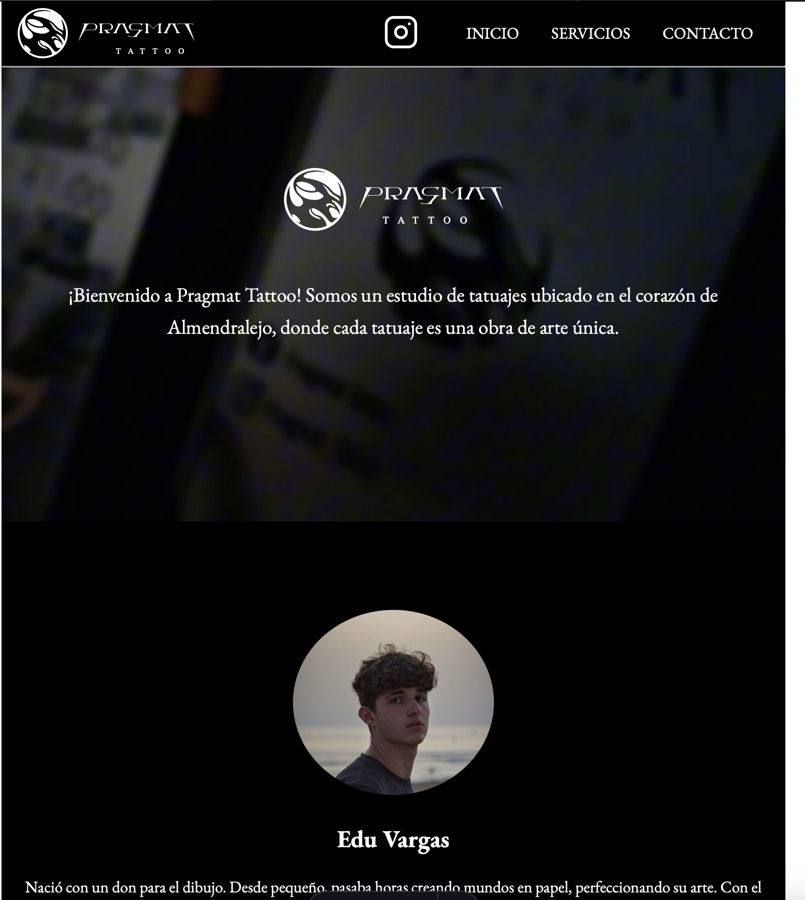
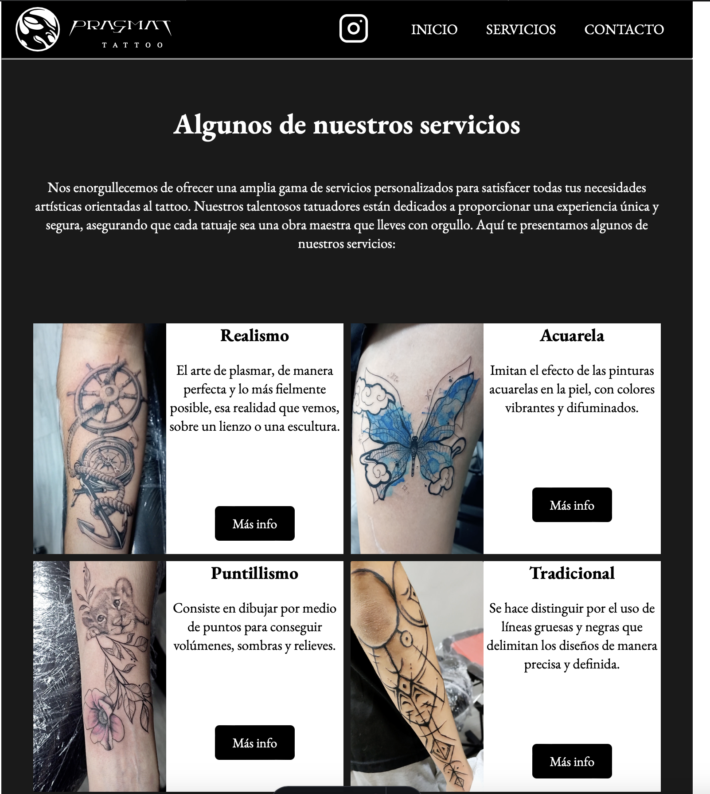
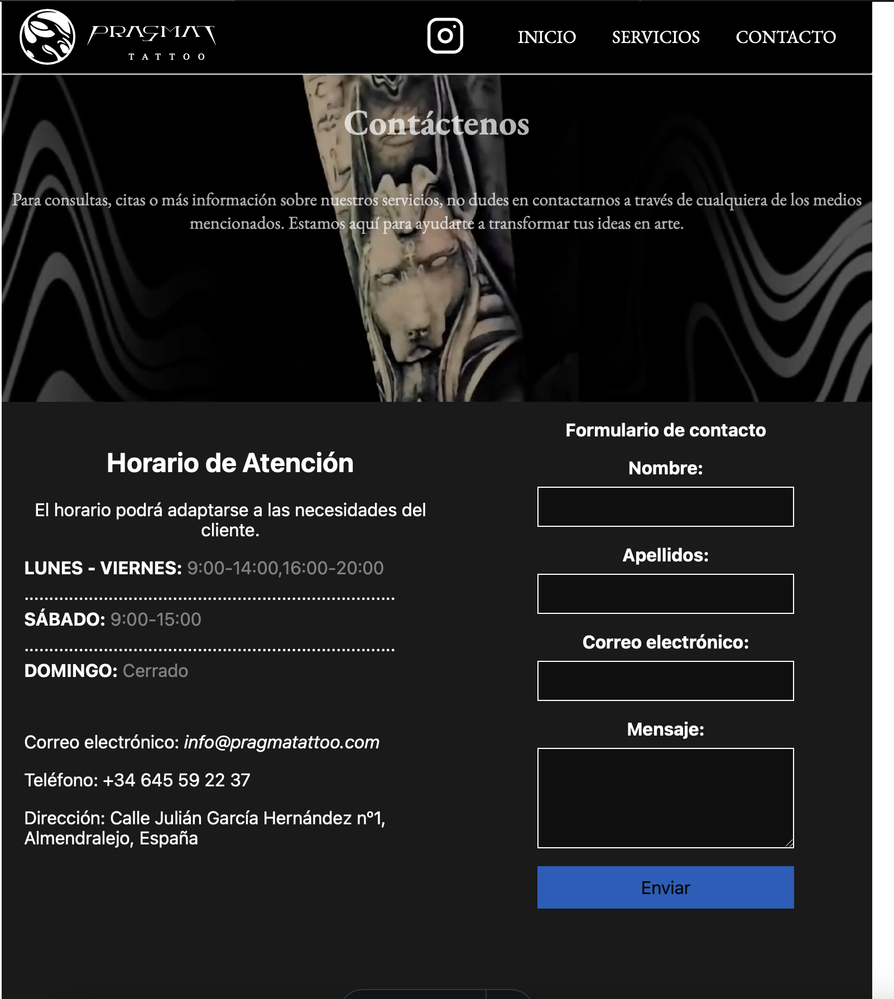
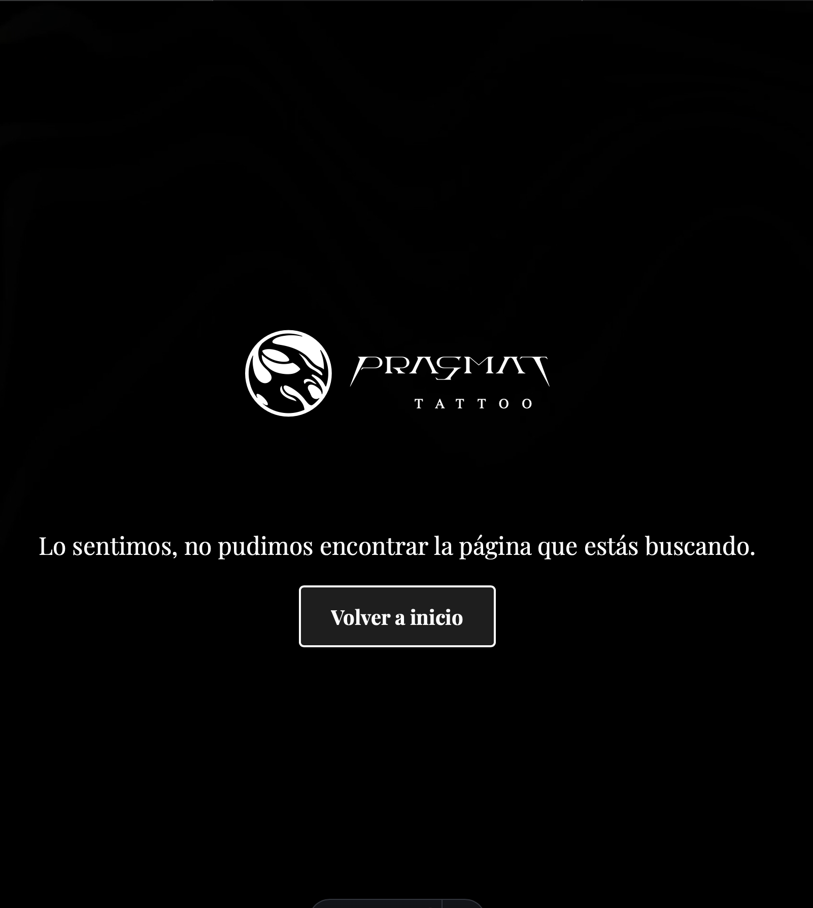
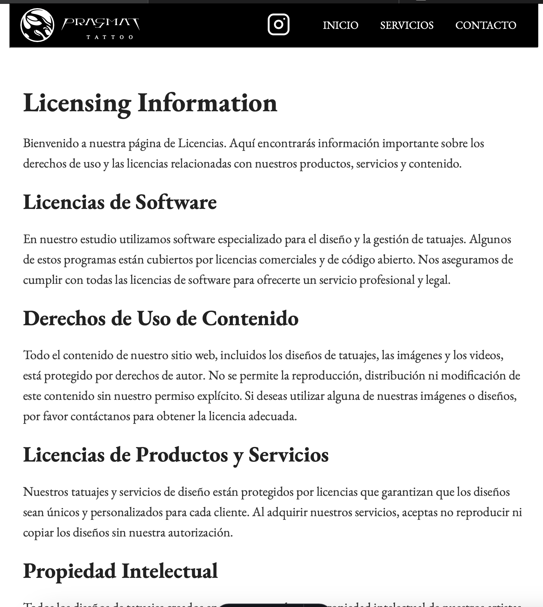
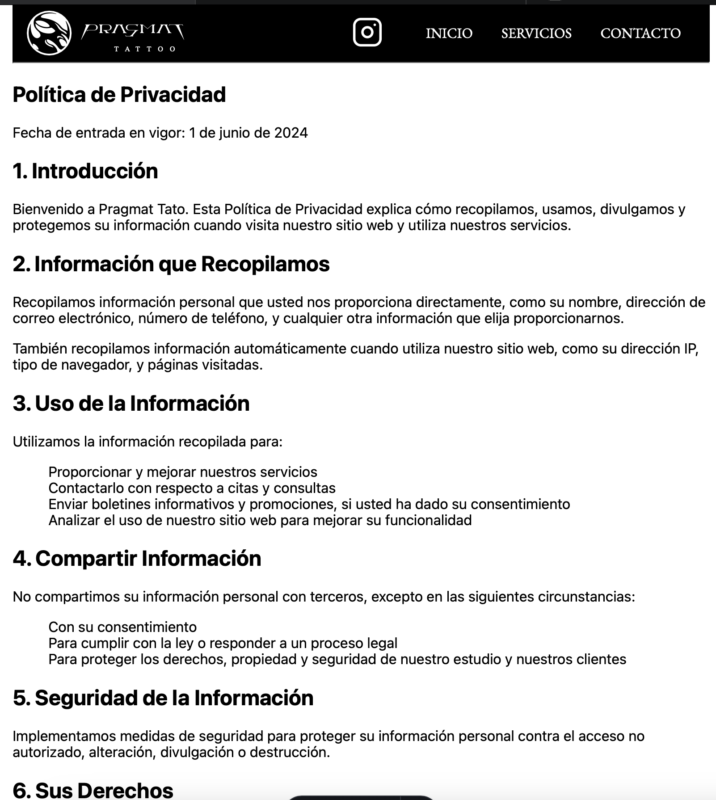

# Nombre del Proyecto
Pragmat Tattoo Studio

## Descripción del Proyecto
Este proyecto es la página web para Pragmat Tattoo, un estudio de tatuajes ubicado en el corazón de Almendralejo. La página muestra información sobre el artista principal, Edu Vargas, su trayectoria, y muestra una galería de trabajos realizados. La página también cuenta varios videos de fondo, un carrusel de imágenes para resaltar mostrar la calidad del trabajo realizado diariamente. Además decidí poner un mapa, varias cartas y un formulario que a futuro podría integrarse en un servidor. He intentado hacer un footer lo más cercano a la realidad y un header que se adaptase a las circustancias.

## Tecnologías Utilizadas
- HTML5
- CSS3
- JavaScript
- Astro
- Slick Carousel
- jQuery

## Autor/a
José Zafra Crespo

## Colores y Tipografías

### Colores Utilizados
- **Primarios**:
  - Black
  - White
- **Secundarios**:
  - `#111111` (Fondo del Carrusel)
  - Grey
- **Otros**:
  - `rgba(14, 14, 14, 0.95)` (Background )

### Tipografías Utilizadas
- **Principal**: 
  - EB Garamond, serif
- **Secundarios**:
  - Playfair Display
## Despliegue

### Web Utilizada para Desplegar la Página/Sitio Web
- Netlify

### URL de Acceso
- [Pragmat Tattoo Studio](https://resonant-lolly-2ce2fd.netlify.app)

## Fuentes/Recursos Utilizados
- **Slick Carousel**: Para el carrusel de fotos. [Slick Carousel](https://kenwheeler.github.io/slick/) y otra parte de recursos de internet.
- **jQuery**: Para facilitar la manipulación del DOM y la integración de Slick Carousel. [jQuery](https://jquery.com).
- **Astro**: Framework utilizado. [Astro](https://astro.build).
- **Imágenes y Video**: Recursos multimedia propios del estudio Pragmat Tattoo.
- **HTML5 y CSS3**: Rescursos del temario, preguntas en clase a dudas y algo de internet que he ido necesitando por problemas que iban surgiendo.

s
## Capturas de Pantalla

### Página Inicio

### Página Servicios

### Página Conatacto

### 404

### Licensing

### PrivacyPolicy

